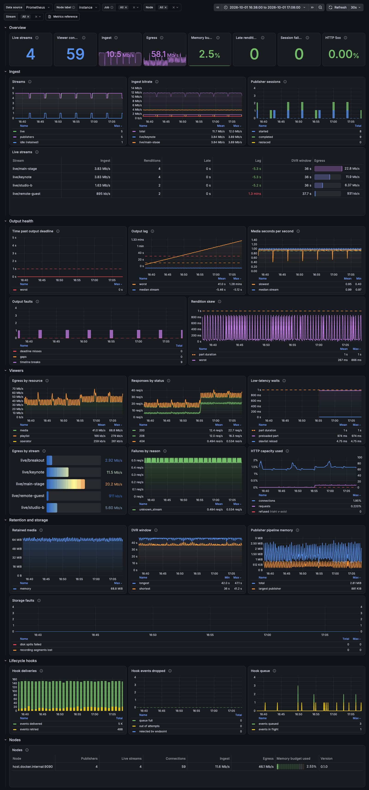

# Monitoring

A Grafana dashboard and Prometheus alert rules for Rushls.



| File | Contents |
| --- | --- |
| [`dashboard.json`](dashboard.json) | Overview: ingest, output health, viewers, retention, hooks, and nodes |
| [`diagnostics.json`](diagnostics.json) | Stall investigation for one stream, including the public playback probe |
| [`alerts.yml`](alerts.yml) | Starting alert rules |
| [`prometheus.yml`](prometheus.yml) | Scrape configuration for both metrics endpoints |

## Set up

1. Turn metrics on in `rushls.toml`. A dedicated listener keeps scrapes off the viewer port:

   ```toml
   [metrics]
   listen = "127.0.0.1:9090"
   token  = { file = "/run/secrets/metrics-token" }   # optional
   ```

2. Scrape both `/metrics` and `/metrics/streams`. The second has the per-stream series
   that the live streams table and the output health panels use. See [`prometheus.yml`](prometheus.yml).

3. In Grafana, go to **Dashboards → New → Import**, upload `dashboard.json`, and choose your Prometheus data source.

## Variables

| Variable | Use |
| --- | --- |
| Data source | Any Prometheus-compatible source, such as Prometheus, Mimir, or VictoriaMetrics |
| Node label | The label that tells origins apart: `instance` for static targets, `pod` for Kubernetes service discovery, `k8s_pod_name` for OpenTelemetry |
| Job | Scrape jobs to include. Keep the `/metrics` and `/metrics/streams` jobs both selected |
| Node, Stream | Narrow the dashboard to some origins or streams |

## Reading it

- **Overview.** Late renditions above zero means viewers are waiting for media right now.
- **Live streams.** One row per stream with a publisher. *Late* is how long the slowest rendition is past its deadline. *Lag* is how far its media has fallen behind real time since the broadcast started; a few seconds either way is normal, and steady growth means the encoder is slower than real time.
- **Output health.** Panels show the worst case and the median across streams, so they stay readable with hundreds of broadcasts a day. Pick a stream to see one.
- **Low-latency waits.** Waiting about one part duration is LL-HLS working as designed: players ask for media before it exists. Much longer means output is slow.
- **Fault panels** stay flat at zero when healthy.

Host CPU, memory, file descriptors, and network come from your infrastructure exporters, not Rushls.
See [Metrics](../../docs/metrics.md) for every metric.

## Changing the dashboard

`dashboard.json` is generated by [`tools/build-dashboard.py`](../../tools/build-dashboard.py). Edit the script, then:

```sh
python3 tools/build-dashboard.py > examples/monitoring/dashboard.json
```

`tools/test_dashboard.py` fails when the JSON and the script differ, or when a panel queries a metric Rushls does not export.
